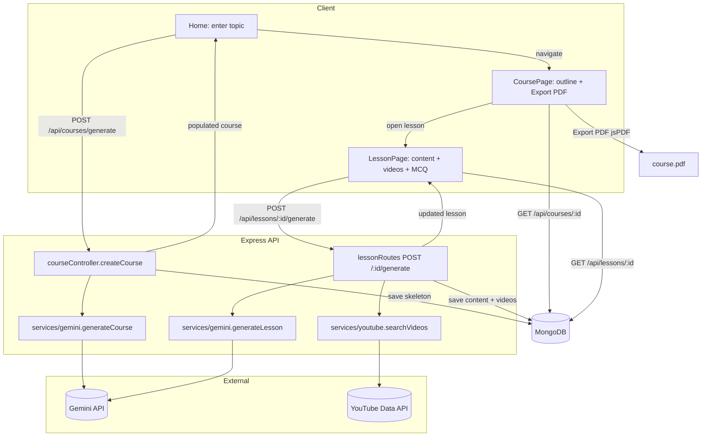

# Architecture

## System overview

Text-to-Learn is two independent processes that talk over HTTP/JSON:

- **client** (Vite dev server, port 5173) — a React SPA with three routes:
  Home (topic entry), CoursePage (outline + PDF export), LessonPage (lesson
  body, videos, quizzes).
- **server** (Express, port 3001) — a thin REST API over MongoDB that also
  owns the two external integrations: **Gemini** (text generation) and
  **YouTube** (video enrichment).

The defining design choice is **two-stage, lazy generation**:

1. Submitting a topic generates only the **course skeleton** — title,
   description, tags, modules, and lesson *titles*. This is one cheap Gemini
   call, so the user sees a full outline almost immediately.
2. A lesson's **body** (prose, code, quiz) and its **videos** are generated
   **on demand**, the first time that lesson is opened. Expensive work is
   deferred until the user actually wants that lesson.

This keeps the first interaction fast and avoids paying for content the user
may never read. (See [DECISIONS.md](DECISIONS.md) for the trade-offs.)

## Request → generation → enrichment → render → export



**Stage 1 (skeleton):** `Home` → `POST /api/courses/generate` →
`createCourse` calls `generateCourse(topic)` (one Gemini call), then writes a
`Course` plus its `Module`s and lesson stubs (`Lesson` docs with empty
`content`) to Mongo, and returns the populated course. The UI navigates to
`/course/:id`.

**Stage 2 (lazy body + enrichment):** opening a lesson loads it; if it has no
content, the user clicks **Generate**, hitting `POST /api/lessons/:id/generate`.
That route calls `generateLesson(...)` (Gemini) for the body, then
`searchVideos(...)` (YouTube) for related videos, saves both onto the `Lesson`,
and returns it.

**Export:** CoursePage already holds the fully-populated course (modules →
lessons, including any generated content + videos), so **Export PDF** is a pure
client-side render via jsPDF — no server round-trip. Lessons not yet generated
are listed as "Not generated yet."

## Data model (MongoDB / Mongoose)

Three collections joined by `ObjectId` references and read back with
`.populate()`:

```
Course ──1:N──► Module ──1:N──► Lesson
  modules[]        lessons[]       (leaf, holds the actual content)
```

| Collection | Fields |
|---|---|
| **Course** | `title*`, `description`, `tags: [String]`, `modules: [→Module]`, timestamps |
| **Module** | `title*`, `course: →Course*`, `lessons: [→Lesson]`, timestamps |
| **Lesson** | `title*`, `objectives: [String]`, `content: [Mixed]*`, `videos: [Video]`, `isEnriched: Bool`, `module: →Module`, timestamps |
| **Video** (subdoc) | `videoId`, `title`, `channel`, `thumbnail`, `url` |

`Lesson.content` is an ordered array of heterogeneous **blocks**, each tagged by
`type`:

- `{ type: 'heading', text }`
- `{ type: 'paragraph', text }`
- `{ type: 'code', language, text }`
- `{ type: 'mcq', question, options[], answer /* 0-based index */, explanation }`

### Why this shape?

- **Normalized (3 collections), not one fat document.** A `Lesson` is the unit
  the app loads, generates, and re-generates independently — the whole point of
  lazy generation. Embedding every lesson body inside the `Course` document
  would make the skeleton write heavy, push toward Mongo's 16 MB document
  limit on big courses, and force a full-course rewrite to update one lesson.
  Separate collections let each lesson be fetched and mutated on its own.
- **References + `populate`, bidirectional.** `Course.modules[]` and
  `Module.lessons[]` give cheap ordered reads top-down; `Lesson.module` and
  `Module.course` give cheap "who owns me?" look-ups (used when generating a
  lesson, which needs its module + course titles for the prompt).
- **`content` is `[Mixed]` (schema-less blocks).** The set of block types is
  driven by what the LLM produces and what the renderer understands; a typed
  Mongoose sub-schema per block would be churn for little safety. The real
  contract for these blocks lives at the generation boundary — which is exactly
  what Checkpoint 1 hardens.
- **`Video` is a sub-schema with `_id: false`.** Videos are owned by a lesson,
  never queried on their own, so they're embedded, not referenced — and they
  don't need their own ids.

See [ANNOTATED.md](ANNOTATED.md) for a line-by-line tour and
[DECISIONS.md](DECISIONS.md) for the alternatives that were weighed.
